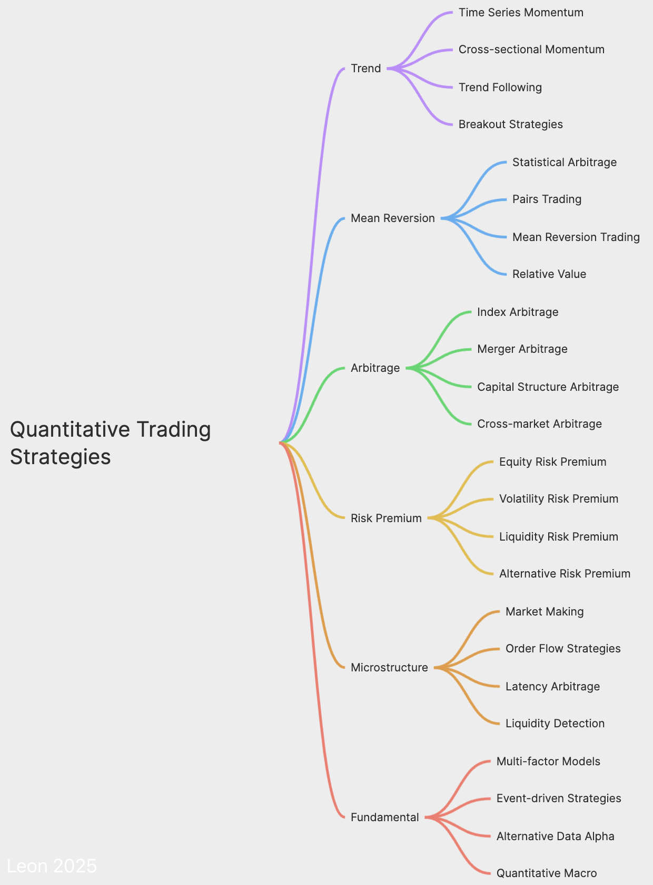

# Awesome Quant AI 

A curated list of awesome resources for quantitative investment and trading strategies focusing on artificial intelligence and machine learning applications in finance.

## Contents

- [Introduction](#introduction)
- [Design Approach](#design-approach)
- [Quantitative Trading Strategies](#quantitative-trading-strategies)
- [Tools and Platforms](#tools-and-platforms)
- [Trading Models Comparison](#trading-models-comparison)
- [Learning Resources](#learning-resources)
- [Books](#books)
- [Research Papers](#research-papers)
- [Community and Conferences](#community-and-conferences)
- [Reference](#Reference)
  
  

## Introduction

Quantitative investing uses mathematical models and algorithms to determine investment opportunities. This repository aims to provide a comprehensive resource for those interested in the intersection of AI, machine learning, and quantitative finance. At its core, this field addresses three pillars:  

1. **Key Challenges in Quantitative Finance**:  
   - **Efficient Market Hypothesis (EMH)**: Balancing the tension between market efficiency and exploitable inefficiencies through rigorous statistical testing.  
   - **Factor Validity**: Identifying persistent drivers of returns (e.g., value, momentum, quality) and assessing their decay over time due to overcrowding or regime shifts.  
   - **Statistical Arbitrage Limits**: Quantifying theoretical profit bounds under constraints like transaction costs, liquidity gaps, and execution latency.  
   - **Cost Modeling**: Integrating bid-ask spreads, slippage, taxes, and market impact into strategy design.  

2. **AI/ML Technical Fit**: 
   - **Predictive Modeling (Supervised Learning):** Forecasting asset returns, volatility, and risk metrics using labeled data with techniques ranging from linear regression to advanced gradient-boosted trees (XGBoost, LightGBM).
   - **Pattern Discovery (Unsupervised Learning):** Identifying latent structures in data through asset clustering, dimensionality reduction, and anomaly detection to uncover novel factors or market regimes.
   - **Sequential Decision-Making (Reinforcement Learning):** Optimizing trading and execution policies through continuous environment interaction, using algorithms like PPO or DDPG to maximize risk-adjusted returns.
   - **Synthetic Data Generation (Generative Models):** Utilizing GANs, Diffusion Models, and other generative techniques to create realistic market scenarios for robust strategy stress-testing and data augmentation.
   - **Contextual Reasoning (Large Language & Multimodal Models):** Achieving a deep, semantic understanding of unstructured financial text, audio, and image data to decode complex informational alpha from filings, news, and earnings calls, far surpassing traditional sentiment analysis.

3. **Mathematical Foundations**:  
   - **Stochastic Processes**: Modeling price dynamics with Brownian motion, jump-diffusion, or fractional processes.  
   - **Optimization Theory**: Mean-CVaR frameworks for balancing returns against tail risks.  
   - **Game Theory**: Simulating strategic interactions among market participants (e.g., order-book competition).  

Quant AI is the application of advanced computational methods to systematically extract **alpha** while rigorously managing risk in complex, adaptive financial systems.

## Design Approach

A scientifically rational design for a quantitative trading system or strategy should adhere to the following process:

1.  **Define Objectives and Constraints:**
    *   Specify investment goals (e.g., absolute return, relative return benchmarks, target risk levels).
    *   Clearly outline risk tolerance, available capital, constraints on trading frequency, and permissible markets and financial instruments.

2.  **Strategy Identification and Research (Alpha Research):**
    *   **Theory-Driven/Literature-Based:** Draw inspiration from established strategy types (e.g., statistical arbitrage, factor investing, trend following) detailed in the source material or academic/practitioner literature.
    *   **Data-Driven Discovery:** Utilize statistical analysis, econometrics, or machine learning techniques (e.g., supervised learning for price prediction, unsupervised learning for factor discovery or regime identification, NLP for sentiment analysis) to explore data and uncover potential trading signals (Alpha).
    *   **Signal/Strategy Combination:** Consider combining multiple, ideally weakly correlated, alpha signals or distinct strategies (e.g., within multi-factor models or multi-strategy frameworks) to enhance portfolio stability and risk-adjusted returns (e.g., Sharpe Ratio).

3.  **Model Development and Calibration:**
    *   Formalize the core strategy logic into specific mathematical models or algorithmic rules.
    *   If employing machine learning, select appropriate models (e.g., linear models, tree-based ensembles, neural networks, reinforcement learning agents) and conduct relevant feature engineering.
    *   Calibrate model parameters judiciously, employing techniques (e.g., regularization, cross-validation) to mitigate the risk of overfitting the training data.

4.  **Rigorous Backtesting and Validation:**
    *   Conduct thorough backtests using high-quality historical data that accurately reflects market conditions.
    *   Realistically account for transaction costs (commissions, slippage) and potential market impact/liquidity constraints.
    *   Perform out-of-sample (OOS) testing and sensitivity analyses to assess robustness. Use cross-validation where appropriate.
    *   Evaluate performance using robust statistical metrics (e.g., Sharpe ratio, Sortino ratio, maximum drawdown, win rate, profit factor) and assess the statistical significance of the results. Consider methodologies like those proposed by Marcos Lopez de Prado to prevent backtest overfitting.

5.  **Integrate Robust Risk Management:**
    *   Embed strategy-level risk controls (e.g., stop-losses, position sizing rules based on volatility or risk contribution).
    *   Apply portfolio-level risk management techniques (e.g., diversification, risk parity principles, asset allocation overlays, correlation monitoring).
    *   Develop contingency plans for managing exposure during extreme market events (tail risk / black swans).

6.  **System Implementation and Deployment:**
    *   Select or develop the appropriate technological infrastructure (trading platforms, data feeds, execution systems).
    *   Ensure data integrity and low-latency, reliable execution capabilities (especially critical for higher-frequency strategies).
    *   Consider leveraging cloud computing resources for computationally intensive tasks (backtesting, model training) and deployment scalability.

7.  **Continuous Monitoring and Iteration:**
    *   Post-deployment, continuously monitor live trading performance against expectations and track evolving market conditions.
    *   Periodically evaluate the strategy's efficacy and diagnose potential performance degradation or alpha decay.
    *   Based on monitoring feedback and ongoing research, systematically adjust, optimize, refine, or potentially retire the strategy. (Note: For AI-Agent trading paradigms, aspects of this monitoring and adaptation loop may be automated).
   

## Quantitative Trading Strategies

### 1. Statistical Arbitrage

- Exploiting pricing inefficiencies among related financial instruments using advanced statistical models.
- **Sub-strategies**:
  * **Mean Reversion**: Assuming asset prices will revert to their historical average.
  * **Pairs Trading**: Taking long and short positions in correlated securities.
  * **Cointegration Analysis**: Exploiting long-term price relationships.

### 2. Factor Investing

- Investing in securities that exhibit characteristics associated with higher returns, such as value, momentum, or size.
- **Factors**:
  * **Value**: Selecting undervalued stocks.
  * **Momentum**: Buying recent winners and selling losers.
  * **Size**: Investing in small-cap stocks.
  * **Quality**: Selecting stocks based on financial health indicators.
  * **Low Volatility**: Investing in stocks with lower price fluctuations.

### 3. High-Frequency Trading (HFT)

- Rapid trading using powerful computers and algorithms.
- **Approaches**:
  * **Market Making**: Providing liquidity by simultaneously placing buy and sell orders.
  * **Latency Arbitrage**: Exploiting tiny price discrepancies.
  * **Order Flow Prediction**: Anticipating and acting on order flow patterns.

### 4. Trend Following

- Trading based on the continuation of price trends.
- **Methods**:
  * **Moving Averages**: Using price averages to identify trends.
  * **Breakout Trading**: Entering positions when prices move beyond support/resistance levels.
  * **Momentum Indicators**: Using technical indicators to measure price velocity.

### 5. Volatility Trading

- Strategies focused on market volatility rather than directional moves.
- **Methods**:
  * **Options Pricing**: Using volatility models for options valuation.
  * **Volatility Arbitrage**: Exploiting differences between implied and realized volatility.

### 6. Risk Parity

- Allocating capital based on risk, balancing the contributions of different assets to overall portfolio volatility.
- **Implementation**:
  * **Balancing Risk Contributions**: Across different asset classes.
  * **Leveraging Lower-Risk Assets**: To achieve the desired risk/return profile.

### 7. Quantitative Macro Strategies

- Trading based on macroeconomic factors and global market trends.
- **Approaches**:
  * **Global Macro**: Trading based on broad economic trends.
  * **Asset Allocation**: Dynamically adjusting portfolio composition based on market conditions.

### 8. Event-Driven Strategies

- Trading based on specific events or news.
- **Examples**:
  * **Merger Arbitrage**: Trading around M&A activities.
  * **Earnings Announcements**: Trading based on financial report releases.
  * **Economic Data Releases**: Trading on macroeconomic news.

### 9. Machine Learning and AI Strategies

- Utilizing AI to improve human decision-making processes and improve investment strategies. Deploying algorithms to analyze vast datasets and enhance the accuracy and efficiency of financial models.
- **Techniques**:
  * **Supervised Learning**: Predicting outcomes using labeled data.
  * **Unsupervised Learning**: Discovering hidden patterns in data.
  * **Reinforcement Learning**: Learning optimal strategies through environment interaction.
  * **Natural Language Processing (NLP)**: Analyzing text data for trading signals.

### 10. Multi-Strategy Approach

- Combining multiple strategies to diversify and enhance performance.
- **Examples**:
  * **Multi-Factor Models**: Integrating multiple factors in a single strategy.
  * **Strategy Allocation**: Dynamically allocating capital across various quantitative strategies.
    
| **Category**                | **Sub-directions**                                                                 | **Technical Stack & Tools**                                                                 | **Real-World Applications**                                                                 |
|----------------------------|-------------------------------------------------------------------------------------|----------------------------------------------------------------------------------------------|---------------------------------------------------------------------------------------------|
| **AI-Enhanced Traditional Strategies** | 1. **Factor Investing**:   - SHAP feature selection for factor validity  - Dynamic factor weighting calibration  - Nonlinear factor fusion (XGBoost/GNN) 2. **Statistical Arbitrage**: - Cointegration + Graph Neural Networks - Kalman Filter for pairs trading 3. **Trend Following**: - CNN for candlestick pattern recognition (e.g., head-and-shoulders) - LSTM anomaly detection for trend reversal signals | - Pyfolio (performance attribution)  - Alphalens (factor testing)  - Featuretools (automated feature engineering)  - DGL (Graph Neural Network library) | - Multi-factor equity selection systems (A-shares/US stocks)  - Crypto cross-exchange arbitrage  - Commodity futures trend tracking strategies               |
| **End-to-End AI Strategies**         | 1. **Reinforcement Learning (RL)**: - DDPG/PPO for asset allocation - Deep Q-learning for order execution optimization 2. **Transformer-Based Forecasting**: - TimesNet for multi-scale volatility prediction - Informer for long-horizon price modeling 3. **Multi-Agent Market Simulation**: - DeFi liquidity - Adversary behavior inference       | - Stable Baselines3 (RL framework)  - Hugging Finance (Transformers for Time Series)  - PettingZoo (multi-agent training environment) | - Adaptive options hedging (Black-Scholes)  - Crypto market-making  - Stress-testing under extreme market scenarios      |
| **Cross-Domain Emerging Fields**     | 1. **Crypto Market Making**: - Order-book state prediction (LSTM+attention) - MEV arbitrage path optimization 2. **ESG Factor Quantification**: - BERT for ESG report parsing - ESG-financial metric nonlinear modeling 3. **Climate Risk Pricing**: - Physical risks: Natural disaster data mapping to asset exposure - Transition risks: Carbon price sensitivity analysis + policy text mining | - CoinMetrics (crypto data)  - SASB standards (ESG metrics)  - Bloomberg NEF (climate finance)  - TensorFlow Probability (uncertainty quantification) | - Carbon-neutral ETF dynamic rebalancing  - Extreme weather-driven commodity strategies  - Blockchain MEV extraction bots                  |

## Trading Paradigms Comparison

Comparing three major approaches to quantitative trading: Quantitative Trading, Algorithmic Trading, and AI-Agent Trading.

| Feature | Quantitative Trading | Algorithmic Trading | AI-Agent Trading |
|---------|----------------------------------|-------------------------|---------------------|
| **Decision Process** | Static rules based on mathematical models and historical data | Predefined algorithmic logic with optimization mechanisms | Autonomous learning and decision-making agents adapting to environment changes |
| **Adaptability** | Low, requires manual parameter and rule adjustments | Medium, self-adapts through parameter optimization | High, real-time learning and adaptation to market conditions |
| **Market Understanding** | Limited to pre-programmed rule scopes | Medium, can capture some complex patterns | Comprehensive, can understand and adapt to complex market structures |
| **Learning Capability** | None or limited | Based on supervised learning or parameter optimization | Autonomous learning and exploration abilities, can improve strategies through reinforcement learning |
| **Flexibility** | Low, fixed rules | Medium, adjustable algorithms but fixed frameworks | High, autonomous adjustment of strategies and objectives |
| **Transparency** | High, clear and explainable rules | Medium, higher algorithm complexity but traceable | Lower, decision processes may be "black box" |
| **Risk Management** | Fixed rule-based risk control | Built-in algorithmic risk control mechanisms | Dynamic risk assessment and adaptive risk management |
| **Complexity** | Low to medium | Medium to high | High, involving complex AI/ML models and architectures |
| **Computational Requirements** | Lower | Medium | High, especially during training phases |
| **Data Dependency** | Relies on specific types of historical data | Strong dependency on multiple data sources | Can process multi-dimensional, unstructured data including real-time feedback |
| **Maintenance Cost** | Lower, simple and stable rules | Medium, requires periodic adjustments and optimization | High, requires continuous monitoring and possible retraining |
| **Innovation Potential** | Limited by preset rules | Medium, achievable through algorithm optimization | High, can discover new trading strategies and opportunities |
| **Typical Applications** | Trend following, mean reversion, fundamental quantitative analysis | Statistical arbitrage, high-frequency trading, factor models | Adaptive trading systems, hybrid strategy optimization, multi-objective decision making |
| **Recent Developments** | Integration of more data sources | Introduction of machine learning to optimize algorithm parameters | Multi-agent collaboration, meta-learning, transfer learning applications |

## Tools and Platforms

List of software tools and platforms used in quantitative finance.

- pytrade: python packages and resources for algo-trading https://github.com/PFund-Software-Ltd/pytrade.org
- pybroker: focus on strategies backtesting that use machine learning https://github.com/edtechre/pybroker

#### 1. **Strategy Development Frameworks**
| **Tool**              | **Strength**                          | **Community Activity** | **Academic Adoption** | **Enterprise Use** |
|-----------------------|----------------------------------------|------------------------|-----------------------|--------------------|
| **Backtrader**        | Multi-factor strategy backtesting       | High                   | Medium                | Medium             |
| **Zipline**           | End-to-end trading pipelines            | Medium                 | High                  | High (Quantopian)  |
| **QuantConnect**      | Cross-market support (stocks, crypto)   | High                   | Medium                | High               |
| **TensorTrade**       | Reinforcement learning prototyping      | Medium                 | Medium                | Medium             |
| **Ray/Rllib**         | Adaptive strategies in complex environments | High                | High                  | High               |

#### 2. **Data Providers**
| **Provider**          | **Key Features**                        | **Use Cases**                          |
|-----------------------|-----------------------------------------|----------------------------------------|
| **Alpha Vantage**     | Free APIs for stock/crypto data         | Historical price/volume analysis       |
| **Quandl**            | Premium structured datasets             | Macroeconomic/factor data integration  |
| **Yahoo Finance**     | Open-source financial data              | Basic equity/ETF research              |
| **Bloomberg Terminal**| Institutional-grade market data         | High-frequency trading, ESG analytics  |
| **CoinMetrics**       | Crypto-specific metrics                 | On-chain transaction analysis, MEV tracking |

#### 3. **Execution & Deployment**
- **Interactive Brokers API** : Low-latency order execution
- **Alpaca** : Commission-free algorithmic trading
- **AWS SageMaker** : Cloud-based ML training/deployment
- **Docker/Kubernetes** : Containerization for scalable systems

#### 4. **Research Environments**
- **Jupyter Notebook**: Interactive strategy prototyping.
- **Databricks**: Big-data processing for alternative data streams.

## Learning Resources

Online courses, tutorials, and workshops focused on quantitative investing and machine learning in finance.

- Algorithmic Trading & Quantitative Analysis Using Python https://www.udemy.com/course/algorithmic-trading-quantitative-analysis-using-python/
- Quantitative Trading Strategies https://finmath.uchicago.edu/curriculum/degree-concentrations/trading/finm-33150/
- Oxford Algorithmic Trading Programme https://www.sbs.ox.ac.uk/programmes/executive-education/online-programmes/oxford-algorithmic-trading-programme
- https://orfe.princeton.edu/research/financial-mathematics
  

## Books

This section curates significant books in the realms of quantitative finance, algorithmic trading, and market data analysis. Each book listed has proven to be invaluable for learning and applying quantitative techniques in the financial markets.

### Trading Systems and Quantitative Methods

- [Quantitative Trading: How to Build Your Own Algorithmic Trading Business](https://amzn.to/3E9DaQY) by Ernest Chan - A great introduction to quantitative trading for retail traders.
- [Algorithmic Trading: Winning Strategies and Their Rationale](https://amzn.to/3AAmz6H) by Ernest Chan - Advanced strategies for developing and testing algorithmic trading systems.
- [Machine Trading: Deploying Computer Algorithms to Conquer the Markets](https://www.amazon.com/Machine-Trading-Deploying-Computer-Algorithms/dp/1119219604/) by Ernest Chan - Introduction to strategies in factor models, AI, options, time series analysis, and intraday trading.
- [Mechanical Trading Systems](https://amzn.to/3ETO8KP) by Richard Weissman - Discusses momentum and mean reversion strategies across different time frames.
- [Following the Trend](https://amzn.to/3tSVBDA) by Andreas Clenow - Insightful read on trend following, a popular quantitative trading strategy.
- [Trade Your Way to Financial Freedom](https://amzn.to/48JJg6M) by Van Tharp - Structured approaches to developing personal trading systems.
- [The Mathematics of Money Management](https://amzn.to/3vusj1X) by Ralph Vince - Techniques on risk management and optimal portfolio configuration.
- [Intermarket Trading Strategies](https://amzn.to/48R3Mmm) by Markos Katsanos - Explores global market relationships for strategy development.
- [Applied Quantitative Methods for Trading and Investment](https://amzn.to/497TJJN) by Christian Dunis et al. - Practical applications of quantitative techniques in trading.
- [Algorithmic Trading and DMA](https://amzn.to/3SfM1Yq) by Barry Johnson - An introduction to direct market access and trading strategies.
- [Technical Analysis from A to Z](https://amzn.to/3Sf8vZx) by Steven Achelis - A comprehensive guide to technical analysis indicators.
- [Finding Alphas: A Quantitative Approach to Building Trading Strategies](https://www.amazon.com/Finding-Alphas-Quantitative-Approach-Strategies/dp/1119571219/) by Igor Tulchinsky - Discusses the process of finding trading strategies (alphas).
- [Algorithmic and High-Frequency Trading](https://a.co/d/0fDaYzL) by Álvaro Cartea, Sebastian Jaimungal, and José Penalva - Provides an in-depth understanding of high-frequency trading strategies.
- [Quantitative Trading: How to Build Your Own Algorithmic Trading Business](https://a.co/d/ieLqNPA) by Ernest P. Chan - A comprehensive guide to starting a quantitative trading business.
- [Building Reliable Trading Systems: Tradable Strategies That Perform As They Backtest and Meet Your Risk-Reward Goals](https://a.co/d/aICoI0O) by Keith Fitschen - Focuses on developing trading systems that perform well in real-world conditions.
- [Professional Automated Trading: Theory and Practice](https://a.co/d/hZQvWw8) by Eugene A. Durenard - A practical guide to automated trading systems.
- [Quantitative Investing: From Theory to Industry](https://a.co/d/cq0uukj) by Lingjie Ma, 
- [Machine Learning for Algorithmic Trading, 2nd Edition](https://a.co/d/9ZaA1SI) by Stefan Jansen
- [Machine Trading: Deploying Computer Algorithms to Conquer the Markets](https://a.co/d/7PO4ZsN) by Ernest P. Chan
- [Trading Systems and Methods, 6th Edition](https://a.co/d/abDVQCE) by Perry J. Kaufman

### Behavioral and Historical Perspectives

- [Reminiscences of a Stock Operator](https://amzn.to/3TWBZwC) by Edwin Lefèvre - Classic insights into the life and trading psychology of Jesse Livermore.
- [When Genius Failed](https://amzn.to/3HhbYk2) by Roger Lowenstein - The rise and fall of Long-Term Capital Management.
- [Predictably Irrational](https://amzn.to/3vojdDR) by Dan Ariely - A look at the forces that affect our decision-making processes.
- [Behavioral Investing](https://amzn.to/48QA2Ws) by James Montier - Strategies to overcome psychological barriers to successful investing.
- [The Laws of Trading](https://amzn.to/41Svo82) by Agustin Lebron - Decision-making strategies from a professional trader's perspective.
- [Thinking, Fast and Slow](https://a.co/d/fWGSCVt) by Daniel Kahneman - A classic on human decision-making and cognitive biases, crucial for understanding market behavior.
- [The Undoing Project](https://a.co/d/3ykJOZ4) by Michael Lewis - Chronicles the collaboration between Daniel Kahneman and Amos Tversky and their contributions to behavioral economics.

### Statistical and Econometric Analysis

- [Machine Learning for Algorithmic Trading](https://amzn.to/3vEZnUX) by Stefan Jansen - Techniques for developing automated trading strategies using machine learning.
- [Advances in Financial Machine Learning](https://www.amazon.com/Advances-Financial-Machine-Learning-Marcos/dp/1119482089/) by Marcos Lopez de Prado - Discusses the challenges and opportunities of applying ML/AI in trading.
- [Machine Learning for Asset Managers](https://www.amazon.com/Machine-Learning-Managers-Elements-Quantitative/dp/1108792898/) by Marcos Lopez de Prado - Focuses on portfolio construction, feature selection, and identifying overfit models.
- [Time Series Analysis](https://amzn.to/3Scqe3M) by James Hamilton - Statistical methods for analyzing time series data in economics and finance.
- [Econometric Analysis](https://amzn.to/421gNre) by William Greene - A fundamental textbook on econometric methods.
- [Wavelet Methods for Time Series Analysis](https://amzn.to/3Sap8p3) by Donald Percival and Andrew Walden - Utilizes wavelet analysis for financial time series.
- [The Elements of Statistical Learning](https://amzn.to/47v3Y9M) by Hastie, Tibshirani, and Friedman - A comprehensive overview of statistical learning theory and its applications.
- [Applied Econometric Time Series](https://a.co/d/6QezCpN) by Walter Enders - demonstrates modern techniques for developing models capable of forecasting, interpreting, and testing hypotheses concerning economic data.
- [Data-Driven Science and Engineering: Machine Learning, Dynamical Systems, and Control](https://a.co/d/iueGzGt) by Steven L. Brunton and J. Nathan Kutz - Focuses on the application of machine learning in scientific and engineering contexts.
- [Big Data and Machine Learning in Quantitative Investment](https://a.co/d/2yYcZlc) by Tony Guida - Explores the role of big data and machine learning in quantitative investment.
- [Big Data Science in Finance](https://a.co/d/6CSzdng) by Irene Aldridge and Marco Avellaneda - Provides insights into the application of big data science in the financial industry.
- [Machine Learning and Data Sciences for Financial Markets: A Guide to Contemporary Practices](https://a.co/d/cjyetTU) by Agostino Capponi and Charles-Albert Lehalle - A comprehensive guide to contemporary practices in machine learning and data sciences for financial markets.
- [Machine Learning in Finance: From Theory to Practice](https://a.co/d/2qmNycY) by Matthew F. Dixon, Igor Halperin, and Paul Bilokon - Covers the theory and practice of applying machine learning in finance.
- [Machine Learning For Financial Engineering](https://a.co/d/h5HNAJn) by László Györfi, György Ottucsák - Focuses on the application of machine learning techniques in financial engineering.

### Mathematical Optimization and Stochastic Calculus

- [Convex Optimization](https://amzn.to/47wyXC0) by Stephen Boyd and Lieven Vandenberghe - A detailed guide on convex optimization techniques used in finance.
- [Financial Calculus](https://amzn.to/47z9yYB) by Martin Baxter and Andrew Rennie - An introduction to derivatives pricing using stochastic calculus.
- [Stochastic Calculus for Finance I](https://amzn.to/4aVQmHx) by Steven Shreve - Introduction to stochastic calculus for financial modeling.
- [Stochastic Calculus for Finance II](https://amzn.to/48x9gTw) by Steven Shreve - Advanced concepts in stochastic calculus for complex financial models.
- [Optimization Methods in Finance](https://a.co/d/iO2psXG) by Gérard Cornuéjols and Reha Tütüncü - Introduces optimization techniques and their applications in finance.
- [Kalman Filtering: with Real-Time Applications](https://a.co/d/hxKREtG) by Charles K. Chui and Guanrong Chen - A practical guide to the application of Kalman filtering in real-time systems.

### Portfolio Management and Financial Instruments

- [Modern Portfolio Theory and Investment Analysis](https://amzn.to/3RSjuGY) by Elton et al. - An in-depth look at Modern Portfolio Theory and its practical applications.
- [Options, Futures, and Other Derivatives](https://a.co/d/bmyR3xP) by John Hull - Essential reading on derivatives trading.
- [Asset Management: A Systematic Approach to Factor Investing](https://a.co/d/8OCWkyE) by Andrew Ang - Discusses a systematic approach to factor investing.
- [Portfolio Management under Stress: A Bayesian-Net Approach to Coherent Asset Allocation](https://a.co/d/4j9jEgE) by Riccardo Rebonato and Alexander Denev - Focuses on portfolio management strategies under stressful market conditions.
- [Quantitative Equity Portfolio Management](https://a.co/d/9IdfYsu) by Ludwig Chincarini and Daehwan Kim - Advanced techniques focused on quantitative equity portfolio management.

### Volatility Analysis and Options Trading

- [Volatility and Correlation](https://amzn.to/3HdkMY7) by Riccardo Rebonato - Discusses volatility and correlation in financial markets and their use in risk management.
- [Study Guide for Options as a Strategic Investment](https://amzn.to/3RSHiu3) by Lawrence McMillan - A comprehensive analysis of options strategies for various market conditions.
- [Volatility Trading](https://amzn.to/48JPfZo) by Euan Sinclair - Practical strategies for trading volatility.
- [The Volatility Surface](https://amzn.to/48JPLqi) by Jim Gatheral - Properties of the volatility surface and its implications for pricing derivatives.
- [Dynamic Hedging: Managing Vanilla and Exotic Options](https://a.co/d/iIuWobT) by Nassim Nicholas Taleb - Introduces dynamic hedging strategies and their applications in managing standard and exotic options.

### Python and Programming

- [Python for Finance](https://amzn.to/3ERSi5D) by Yves Hilpisch - Essential techniques for algorithmic trading and derivatives pricing.
- [Python for Algorithmic Trading: From Idea to Cloud Deployment](https://www.amazon.com/Python-Algorithmic-Trading-Cloud-Deployment/dp/149205335X/) by Yves Hilpisch - Comprehensive guide on implementing trading strategies in Python, from data handling to cloud deployment.
- [Python for Finance Cookbook - Second Edition](https://a.co/d/08GbZnXP) by Eryk Lewinson - Over 80 powerful recipes for effective financial data analysis, using modern Python libraries such as pandas, NumPy, and scikit-learn.
- [Python for Data Analysis](https://a.co/d/gGEBzt1) by Wes McKinney - Written by the creator of the Pandas library, this book is essential for financial data analysis.

### Biographies

- [The Man Who Solved the Market: How Jim Simons Launched the Quant Revolution](https://a.co/d/00VsEzC2) by Gregory Zuckerman - The unbelievable story of Jim Simons, a secretive mathematician who pioneered the era of algorithmic trading and made $23 billion doing it, whose Renaissance's Medallion fund has generated average annual returns of 66 percent since 1988.
- [Poor Charlie's Almanack: The Essential Wit and Wisdom of Charles T. Munger](https://a.co/d/0byTXb7A) by Charles T. Munger, Peter D. Kaufman (Editor), Warren Buffett (Foreword), John Collison (Foreword) - This book offers lessons in investment strategy, philanthropy, and living a rational and ethical life.
- [More Money Than God: Hedge Funds and the Making of a New Elite](https://a.co/d/6yQggnh) by Sebastian Mallaby - Details the history of hedge funds and their impact on financial markets.

## Research Papers

Seminal and recent research that advances the field of quantitative finance.

## Community and Conferences

Information on communities, meetups, and conferences dedicated to quantitative finance.

Feel free to explore these resources to deepen your understanding of quantitative finance and improve your trading strategies.

## Reference

- 46 awesome books for quant finance, algo trading, and market data analysis
  https://www.pyquantnews.com/the-pyquant-newsletter/46-books-quant-finance-algo-trading-market-data
- 10 awesome books for Quantitative Trading
  https://medium.com/@mlblogging.k/10-awesome-books-for-quantitative-trading-fc0d6aa7e6d8
- Books for Algorithmic Trading I Wish I Had Read Sooner
  https://www.youtube.com/watch?v=ftFptCxm5ZU
- Awesome Systematic Trading 
  https://github.com/paperswithbacktest/awesome-systematic-trading
