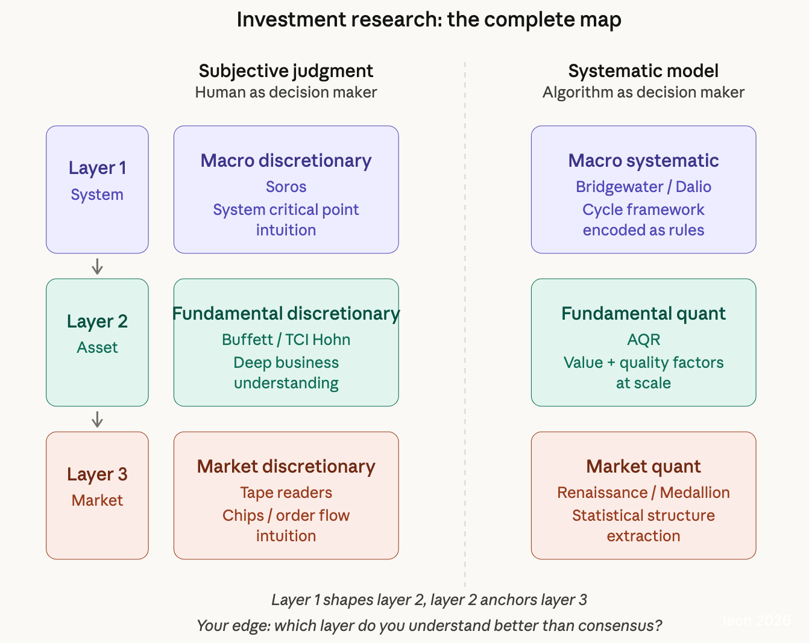
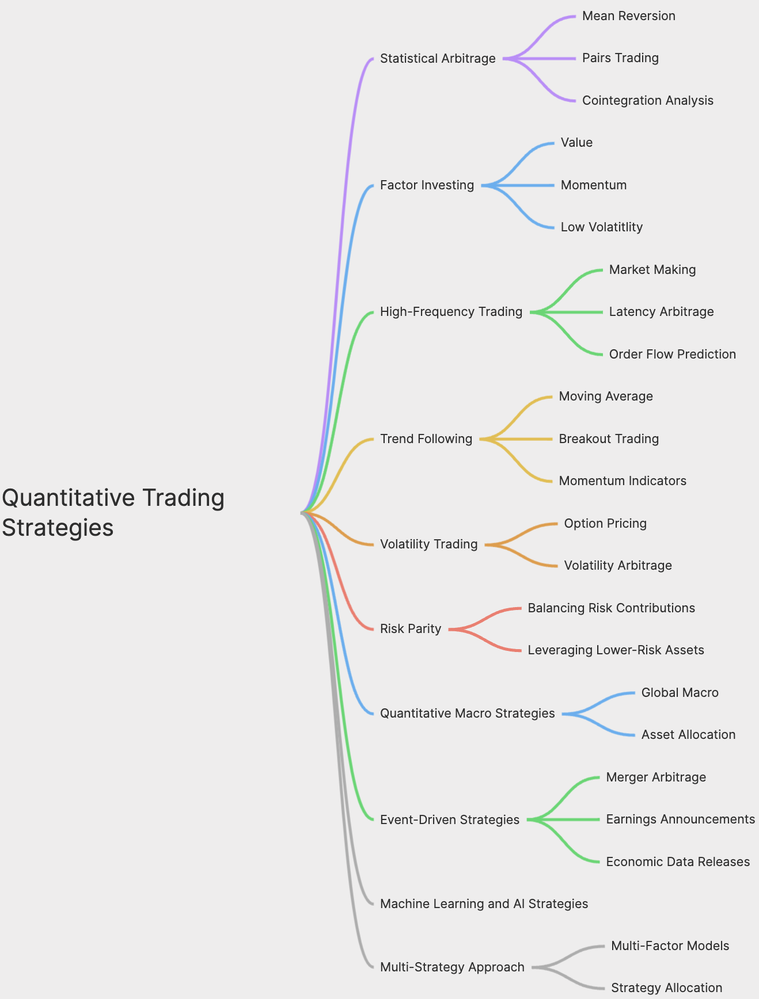
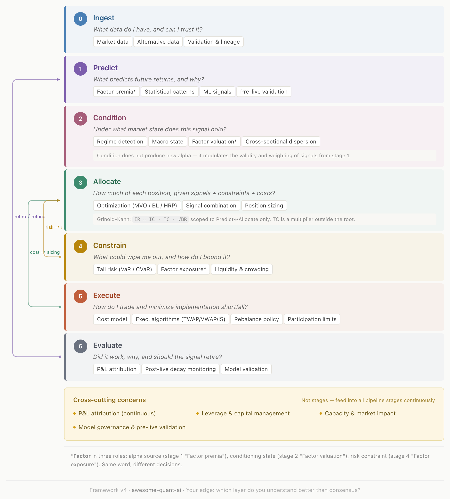

# Awesome Quant AI

A curated list of awesome resources for quantitative investment and trading strategies focusing on artificial intelligence and machine learning applications in finance.

 

 

*Your edge: which layer do you understand better than consensus?*

⭐ Beyond curated links, this project includes an [original 8-chapter bilingual strategy guide](#original-research-and-notes) with Python implementations and [research essays](#research-essays-think) on regime detection and AI-agent trading.

 

## Contents

- [Introduction](#introduction)
- [Design Approach](#design-approach)
- [Quantitative Trading Strategies](#quantitative-trading-strategies)
- [Trading Paradigms Comparison](#trading-paradigms-comparison)
- [Frontier: Emerging Topics (2025/2026)](#frontier-emerging-topics-20252026)
- [Tools and Platforms](#tools-and-platforms)
- [Learning Resources](#learning-resources)
- [Books](#books)
- [Research Papers](#research-papers)
- [Original Research and Notes](#original-research-and-notes)
- [Community and Conferences](#community-and-conferences)
- [Related Lists](#related-lists)
- [Contributing](#contributing)

## Introduction

Quantitative investing uses mathematical models and algorithms to determine investment opportunities. This repository aims to provide a comprehensive resource for those interested in the intersection of AI, machine learning, and quantitative finance. At its core, this field addresses three pillars:  

1. **Key Challenges in Quantitative Finance**:  
   - **Efficient Market Hypothesis (EMH)**: Balancing the tension between market efficiency and exploitable inefficiencies through rigorous statistical testing.  
   - **Factor Validity**: Identifying persistent drivers of returns (e.g., value, momentum, quality) and assessing their decay over time due to overcrowding or regime shifts.  
   - **Statistical Arbitrage Limits**: Quantifying theoretical profit bounds under constraints like transaction costs, liquidity gaps, and execution latency.  
   - **Cost Modeling**: Integrating bid-ask spreads, slippage, taxes, and market impact into strategy design.  

2. **AI/ML Technical Fit**: 
   - **Predictive Modeling (Supervised Learning):** Forecasting asset returns, volatility, and risk metrics using labeled data with techniques ranging from linear regression to advanced gradient-boosted trees (XGBoost, LightGBM).
   - **Pattern Discovery (Unsupervised Learning):** Identifying latent structures in data through asset clustering, dimensionality reduction, and anomaly detection to uncover novel factors or market regimes.
   - **Sequential Decision-Making (Reinforcement Learning):** Optimizing trading and execution policies through continuous environment interaction, using algorithms like PPO or DDPG to maximize risk-adjusted returns.
   - **Synthetic Data Generation (Generative Models):** Utilizing GANs, Diffusion Models, and other generative techniques to create realistic market scenarios for robust strategy stress-testing and data augmentation.
   - **Contextual Reasoning (Large Language & Multimodal Models):** Achieving a deep, semantic understanding of unstructured financial text, audio, and image data to decode complex informational alpha from filings, news, and earnings calls, far surpassing traditional sentiment analysis.

3. **Mathematical Foundations**:  
   - **Stochastic Processes**: Modeling price dynamics with Brownian motion, jump-diffusion, or fractional processes.  
   - **Optimization Theory**: Mean-CVaR frameworks for balancing returns against tail risks.  
   - **Game Theory**: Simulating strategic interactions among market participants (e.g., order-book competition).  

Quant AI is the application of advanced computational methods to systematically extract **alpha** while rigorously managing risk in complex, adaptive financial systems.

## Design Approach

A scientifically rational design for a quantitative trading system or strategy should adhere to the following process:

1.  **Define Objectives and Constraints:**
    *   Specify investment goals (e.g., absolute return, relative return benchmarks, target risk levels).
    *   Clearly outline risk tolerance, available capital, constraints on trading frequency, and permissible markets and financial instruments.

2.  **Strategy Identification and Research (Alpha Research):**
    *   **Theory-Driven/Literature-Based:** Draw inspiration from established strategy types (e.g., statistical arbitrage, factor investing, trend following) detailed in the source material or academic/practitioner literature.
    *   **Data-Driven Discovery:** Utilize statistical analysis, econometrics, or machine learning techniques (e.g., supervised learning for price prediction, unsupervised learning for factor discovery or regime identification, NLP for sentiment analysis) to explore data and uncover potential trading signals (Alpha).
    *   **Signal/Strategy Combination:** Consider combining multiple, ideally weakly correlated, alpha signals or distinct strategies (e.g., within multi-factor models or multi-strategy frameworks) to enhance portfolio stability and risk-adjusted returns (e.g., Sharpe Ratio).

3.  **Model Development and Calibration:**
    *   Formalize the core strategy logic into specific mathematical models or algorithmic rules.
    *   If employing machine learning, select appropriate models (e.g., linear models, tree-based ensembles, neural networks, reinforcement learning agents) and conduct relevant feature engineering.
    *   Calibrate model parameters judiciously, employing techniques (e.g., regularization, cross-validation) to mitigate the risk of overfitting the training data.

4.  **Rigorous Backtesting and Validation:**
    *   Conduct thorough backtests using high-quality historical data that accurately reflects market conditions.
    *   Realistically account for transaction costs (commissions, slippage) and potential market impact/liquidity constraints.
    *   Perform out-of-sample (OOS) testing and sensitivity analyses to assess robustness. Use cross-validation where appropriate.
    *   Evaluate performance using robust statistical metrics (e.g., Sharpe ratio, Sortino ratio, maximum drawdown, win rate, profit factor) and assess the statistical significance of the results. Consider methodologies like those proposed by Marcos Lopez de Prado to prevent backtest overfitting.

5.  **Integrate Robust Risk Management:**
    *   Embed strategy-level risk controls (e.g., stop-losses, position sizing rules based on volatility or risk contribution).
    *   Apply portfolio-level risk management techniques (e.g., diversification, risk parity principles, asset allocation overlays, correlation monitoring).
    *   Develop contingency plans for managing exposure during extreme market events (tail risk / black swans).

6.  **System Implementation and Deployment:**
    *   Select or develop the appropriate technological infrastructure (trading platforms, data feeds, execution systems).
    *   Ensure data integrity and low-latency, reliable execution capabilities (especially critical for higher-frequency strategies).
    *   Consider leveraging cloud computing resources for computationally intensive tasks (backtesting, model training) and deployment scalability.

7.  **Continuous Monitoring and Iteration:**
    *   Post-deployment, continuously monitor live trading performance against expectations and track evolving market conditions.
    *   Periodically evaluate the strategy's efficacy and diagnose potential performance degradation or alpha decay.
    *   Based on monitoring feedback and ongoing research, systematically adjust, optimize, refine, or potentially retire the strategy. (Note: For AI-Agent trading paradigms, aspects of this monitoring and adaptation loop may be automated).

## Quantitative Trading Strategies

### 1. Statistical Arbitrage

- Exploiting pricing inefficiencies among related financial instruments using advanced statistical models.
- **Sub-strategies**:
  * **Mean Reversion**: Assuming asset prices will revert to their historical average.
  * **Pairs Trading**: Taking long and short positions in correlated securities.
  * **Cointegration Analysis**: Exploiting long-term price relationships.
- **Key resources**:
  * [Statistical Arbitrage in the U.S. Equities Market](https://papers.ssrn.com/sol3/papers.cfm?abstract_id=1153505) by Avellaneda and Lee - The canonical PCA/ETF-factor mean-reversion framework.
  * [Pairs Trading: Performance of a Relative-Value Arbitrage Rule](https://papers.ssrn.com/sol3/papers.cfm?abstract_id=141615) by Gatev, Goetzmann, and Rouwenhorst - The foundational empirical study of pairs trading.

### 2. Factor Investing

- Investing in securities that exhibit characteristics associated with higher returns, such as value, momentum, or size.
- **Factors**:
  * **Value**: Selecting undervalued stocks.
  * **Momentum**: Buying recent winners and selling losers.
  * **Size**: Investing in small-cap stocks.
  * **Quality**: Selecting stocks based on financial health indicators.
  * **Low Volatility**: Investing in stocks with lower price fluctuations.
- **Key resources**:
  * [Kenneth French Data Library](https://mba.tuck.dartmouth.edu/pages/faculty/ken.french/data_library.html) - The canonical free source for factor return data (Fama-French factors, momentum, portfolios).
  * [... and the Cross-Section of Expected Returns](https://papers.ssrn.com/sol3/papers.cfm?abstract_id=2249314) by Harvey, Liu, and Zhu - The "factor zoo" critique: why most published factors fail multiple-testing scrutiny.

### 3. High-Frequency Trading (HFT)

- Rapid trading using powerful computers and algorithms.
- **Approaches**:
  * **Market Making**: Providing liquidity by simultaneously placing buy and sell orders.
  * **Latency Arbitrage**: Exploiting tiny price discrepancies.
  * **Order Flow Prediction**: Anticipating and acting on order flow patterns.
- **Key resources**:
  * [Hummingbot](https://github.com/hummingbot/hummingbot) - Open-source framework for running market-making and arbitrage bots on centralized and decentralized exchanges.

### 4. Trend Following

- Trading based on the continuation of price trends.
- **Methods**:
  * **Moving Averages**: Using price averages to identify trends.
  * **Breakout Trading**: Entering positions when prices move beyond support/resistance levels.
  * **Momentum Indicators**: Using technical indicators to measure price velocity.
- **Key resources**:
  * [Time Series Momentum](https://papers.ssrn.com/sol3/papers.cfm?abstract_id=2089463) by Moskowitz, Ooi, and Pedersen - The seminal evidence for trend persistence across 58 futures markets.
  * [pysystemtrade](https://github.com/robcarver17/pysystemtrade) - Robert Carver's open-source systematic futures trading framework implementing his book's methodology.

### 5. Volatility Trading

- Strategies focused on market volatility rather than directional moves.
- **Methods**:
  * **Options Pricing**: Using volatility models for options valuation.
  * **Volatility Arbitrage**: Exploiting differences between implied and realized volatility.
- **Key resources**:
  * [Deep Hedging](https://arxiv.org/abs/1802.03042) by Buehler, Gonon, Teichmann, and Wood - Reinforcement learning for hedging derivatives under transaction costs, beyond Black-Scholes assumptions.

### 6. Risk Parity

- Allocating capital based on risk, balancing the contributions of different assets to overall portfolio volatility.
- **Implementation**:
  * **Balancing Risk Contributions**: Across different asset classes.
  * **Leveraging Lower-Risk Assets**: To achieve the desired risk/return profile.

### 7. Quantitative Macro Strategies

- Trading based on macroeconomic factors and global market trends.
- **Approaches**:
  * **Global Macro**: Trading based on broad economic trends.
  * **Asset Allocation**: Dynamically adjusting portfolio composition based on market conditions.

### 8. Event-Driven Strategies

- Trading based on specific events or news.
- **Examples**:
  * **Merger Arbitrage**: Trading around M&A activities.
  * **Earnings Announcements**: Trading based on financial report releases.
  * **Economic Data Releases**: Trading on macroeconomic news.
- **Key resources**:
  * [Characteristics of Risk and Return in Risk Arbitrage](https://papers.ssrn.com/sol3/papers.cfm?abstract_id=268144) by Mitchell and Pulvino - The definitive empirical study of merger arbitrage returns.

### 9. Machine Learning and AI Strategies

- Utilizing AI to improve human decision-making processes and improve investment strategies. Deploying algorithms to analyze vast datasets and enhance the accuracy and efficiency of financial models.
- **Techniques**:
  * **Supervised Learning**: Predicting outcomes using labeled data.
  * **Unsupervised Learning**: Discovering hidden patterns in data.
  * **Reinforcement Learning**: Learning optimal strategies through environment interaction.
  * **Natural Language Processing (NLP)**: Analyzing text data for trading signals.
- **Key resources**:
  * [machine-learning-for-trading](https://github.com/stefan-jansen/machine-learning-for-trading) - Stefan Jansen's companion code to his book: 150+ notebooks covering the full ML4T workflow from data to deployment.

### 10. Multi-Strategy Approach

- Combining multiple strategies to diversify and enhance performance.
- **Examples**:
  * **Multi-Factor Models**: Integrating multiple factors in a single strategy.
  * **Strategy Allocation**: Dynamically allocating capital across various quantitative strategies.

## Trading Paradigms Comparison

Comparing three major approaches to quantitative trading: Quantitative Trading, Algorithmic Trading, and AI-Agent Trading.

| Feature | Quantitative Trading | Algorithmic Trading | AI-Agent Trading |
|---------|----------------------------------|-------------------------|---------------------|
| **Decision Process** | Static rules based on mathematical models and historical data | Predefined algorithmic logic with optimization mechanisms | Autonomous learning and decision-making agents adapting to environment changes |
| **Adaptability** | Low, requires manual parameter and rule adjustments | Medium, self-adapts through parameter optimization | High, real-time learning and adaptation to market conditions |
| **Learning Capability** | None or limited | Based on supervised learning or parameter optimization | Autonomous learning and exploration, improving strategies through reinforcement learning |
| **Transparency** | High, clear and explainable rules | Medium, higher algorithm complexity but traceable | Lower, decision processes may be "black box" |
| **Risk Management** | Fixed rule-based risk control | Built-in algorithmic risk control mechanisms | Dynamic risk assessment and adaptive risk management |
| **Data Dependency** | Relies on specific types of historical data | Strong dependency on multiple data sources | Can process multi-dimensional, unstructured data including real-time feedback |
| **Typical Applications** | Trend following, mean reversion, fundamental quantitative analysis | Statistical arbitrage, high-frequency trading, factor models | Adaptive trading systems, hybrid strategy optimization, multi-objective decision making |

## Frontier: Emerging Topics (2025/2026)

### LLM-Based Trading Agents

Multi-agent systems using large language models in specialized roles (analyst, trader, risk manager) to collaboratively process unstructured data and make trading decisions — representing a shift from fixed-rule systems toward autonomous, adaptive trading.

- [TradingAgents](https://github.com/TauricResearch/TradingAgents) - Multi-agent LLM trading framework simulating trading firm dynamics with specialized analyst and trader roles; built with LangGraph, supports GPT, Gemini, Claude, and Grok.
- [FinRobot](https://github.com/AI4Finance-Foundation/FinRobot) - Open-source AI agent platform for financial analysis using LLMs with Financial Chain-of-Thought reasoning and smart scheduler for multi-source LLM integration.
- [FinGPT](https://github.com/AI4Finance-Foundation/FinGPT) - Open-source financial LLM framework with data-centric design and LoRA fine-tuning; supports sentiment analysis, robo-advising, and algorithmic trading.
- [FinRL](https://github.com/AI4Finance-Foundation/FinRL) - Financial reinforcement learning framework supporting A2C, DDPG, PPO, TD3, SAC agents; FinRL-X adds modular infrastructure for the LLM/agentic AI era.
- [Vibe-Trading](https://github.com/HKUDS/Vibe-Trading) - Natural-language multi-agent finance research framework with 29 swarm presets (investment committee, quant desk, risk committee); 7 cross-market backtest engines (A-shares/US/Crypto/Futures/Forex/Options) plus a shared-capital CompositeEngine; 5-source auto-fallback data layer (tushare/okx/yfinance/akshare/ccxt); 17-tool MCP server for Claude Desktop; CLI + FastAPI + React frontend.
- [oracle3](https://github.com/YichengYang-Ethan/oracle3) - Autonomous prediction-market trading agent for Kalshi, Polymarket, and Solana DFlow using Wang Transform pricing, Greeks, Kelly sizing, and constraint-based arbitrage strategies; Apache-2.0 with methodology documented in a companion SSRN working paper.

### Transformer Time-Series Foundation Models

Pre-trained transformer models for temporal data that can forecast time series zero-shot or few-shot — offering out-of-the-box price/volatility forecasting and regime identification without task-specific training.

- [Chronos](https://github.com/amazon-science/chronos-forecasting) - Amazon's pretrained time series models; Chronos-2 (120M params) handles univariate, multivariate, and covariate-informed zero-shot forecasting.
- [TimesFM](https://github.com/google-research/timesfm) - Google Research's decoder-only foundation model (200M params) pre-trained on 100B real-world time points.
- [Moirai](https://github.com/SalesforceAIResearch/uni2ts) - Salesforce's masked encoder-based universal forecasting transformer, pre-trained on LOTSA (27B observations, 9 domains); handles any frequency and any number of variates.
- [Lag-Llama](https://github.com/time-series-foundation-models/lag-llama) - First open-source decoder-only foundation model for probabilistic time series forecasting; developed by Morgan Stanley, ServiceNow, and Mila.
- [PatchTST](https://github.com/yuqinie98/PatchTST) - Segments time series into subseries-level patches as transformer tokens, achieving quadratic reduction in attention cost while retaining local semantics.
- [TimeGPT](https://github.com/Nixtla/nixtla) - Production-ready foundation model trained on 100B+ data points with open-source Python/R SDK; offers zero-shot forecasting and anomaly detection via API.

### AI-Driven Alpha Mining

Automating the factor-research loop itself: LLM- and RL-based systems that propose, implement, and backtest alpha factors and models with minimal human intervention.

- [RD-Agent](https://github.com/microsoft/RD-Agent) - Microsoft's LLM-based autonomous R&D agent; its quantitative-finance mode (RD-Agent(Q)) iteratively proposes, codes, and backtests factors and models on top of Qlib.
- [AlphaGen](https://github.com/RL-MLDM/alphagen) - Reinforcement learning framework for generating formulaic alpha factors, optimizing the performance of the factor set as a whole rather than individual factors.

### Financial LLM Evaluation Benchmarks

Standardized benchmarks for measuring what LLMs actually know and can do in finance — essential due diligence before trusting any model with financial analysis.

- [FinanceBench](https://arxiv.org/abs/2311.11944) - Open-book financial QA benchmark of 10,231 questions grounded in public filings; reveals high hallucination rates in frontier LLMs answering from 10-Ks.
- [FinBen](https://arxiv.org/abs/2402.12659) - Holistic financial benchmark spanning 36 datasets across 24 tasks including information extraction, risk forecasting, and decision-making.
- [PIXIU](https://github.com/The-FinAI/PIXIU) - Open-source financial LLM toolkit with the FLARE evaluation benchmark, instruction-tuning data, and the FinMA model family.

### Diffusion Models for Synthetic Financial Data

Denoising diffusion models applied to generate realistic synthetic market data — price series, order flows, and limit order books — enabling robust stress-testing and data augmentation for data-starved financial ML.

- [DeepMarket](https://github.com/LeonardoBerti00/DeepMarket) - Transformer-based diffusion engine for limit order book simulation; generates realistic order flows conditioned on market state.
- [FinDiff](https://github.com/sattarov/FinDiff) - Diffusion model for generating mixed-type financial tabular data; demonstrated high fidelity for downstream tasks like fraud detection and stress testing.
- [FTS-Diffusion](https://openreview.net/forum?id=CdjnzWsQax) - ICLR 2024 scale-invariant diffusion framework for financial time series; reduces stock prediction error by up to 17.9% when used for data augmentation.

### On-Chain / DeFi Quantitative Strategies

Quantitative approaches to decentralized finance: MEV extraction, AMM liquidity provision optimization, yield farming, and on-chain analytics across hundreds of chains.

- [Flashbots mev-boost](https://github.com/flashbots/mev-boost) - Reference implementation of proposer-builder separation (PBS) for Ethereum; core infrastructure for the MEV supply chain.
- [Flashbots rbuilder](https://github.com/flashbots/rbuilder) - Open-source, high-performance Ethereum MEV-Boost block builder written in Rust; supports multiple building algorithms and backtesting.
- [DefiLlama](https://defillama.com/) - Open-source DeFi analytics dashboard tracking TVL, yields, fees, and volumes across thousands of protocols; provides free API via [defillama-sdk](https://github.com/DefiLlama/defillama-sdk).
- [ultimate-defi-research-base](https://github.com/OffcierCia/ultimate-defi-research-base) - Curated collection of DeFi and blockchain research covering MEV, AMM design, yield optimization, and on-chain analytics.

## Tools and Platforms

List of software tools and platforms used in quantitative finance.

#### 1. **Strategy Development Frameworks**
| **Tool**              | **Strength**                          | **Notes** |
|-----------------------|----------------------------------------|-----------|
| **[Qlib](https://github.com/microsoft/qlib)** | AI-oriented quant research platform: factor library, model zoo, workflow automation | Microsoft; the reference open-source platform for ML-driven quant research |
| **[OpenBB](https://github.com/OpenBB-finance/OpenBB)** | Open-source investment research terminal aggregating equity, macro, and crypto data | Free CLI + SDK; large active community |
| **[LEAN](https://github.com/QuantConnect/Lean)** | Institution-grade backtesting and live-trading engine (equities, futures, options, crypto) | Open-source engine behind QuantConnect |
| **[NautilusTrader](https://github.com/nautechsystems/nautilus_trader)** | High-performance event-driven backtesting and live trading | Rust core with Python API; nanosecond precision |
| **[vectorbt](https://github.com/polakowo/vectorbt)** | Vectorized backtesting at scale — thousands of parameter combinations in seconds | Built on NumPy/Numba; ideal for fast strategy sweeps |
| **[Backtrader](https://github.com/mementum/backtrader)** | Feature-rich event-driven backtesting | Mature and widely taught, though maintenance has slowed |
| **[zipline-reloaded](https://github.com/stefan-jansen/zipline-reloaded)** | Community-maintained fork of Quantopian's Zipline | Original Zipline is unmaintained since Quantopian's 2020 shutdown |
| **[pybroker](https://github.com/edtechre/pybroker)** | Backtesting framework designed for ML-driven strategies | Built-in walk-forward analysis and bootstrapped metrics |
| **[Riskfolio-Lib](https://github.com/dcajasn/Riskfolio-Lib)** | Portfolio optimization: mean-risk, risk parity, hierarchical clustering methods | 20+ risk measures; strong documentation |
| **[skfolio](https://github.com/skfolio/skfolio)** | Portfolio optimization with a scikit-learn-compatible API | Cross-validation and hyperparameter tuning for allocation models |
| **[Ray/RLlib](https://github.com/ray-project/ray)** | Distributed reinforcement learning for adaptive strategies | Industry-standard RL infrastructure |

#### 2. **Data Providers**
| **Provider**          | **Key Features**                        | **Use Cases**                          |
|-----------------------|-----------------------------------------|----------------------------------------|
| **[FRED](https://fred.stlouisfed.org/)** | 800K+ US and international macro time series, free API | Macro research, regime models, rates and inflation data |
| **[yfinance](https://github.com/ranaroussi/yfinance)** | Python wrapper for Yahoo Finance data | Free equity/ETF/FX/crypto prices for research and prototyping |
| **[Alpha Vantage](https://www.alphavantage.co/)** | Free APIs for stock/crypto data         | Historical price/volume analysis       |
| **[Nasdaq Data Link](https://data.nasdaq.com/)** | Premium and free structured datasets (formerly Quandl) | Macroeconomic/factor data integration  |
| **[Databento](https://databento.com/)** | Institutional market data (equities, futures, options) with usage-based pricing | Tick-level and order-book data for microstructure research |
| **[akshare](https://github.com/akfamily/akshare)** | Free Python library for Chinese market data (A-shares, futures, funds, macro) | China market research; no account required |
| **[Bloomberg Terminal](https://www.bloomberg.com/professional/products/bloomberg-terminal/)** | Institutional-grade market data         | High-frequency trading, ESG analytics  |
| **[CoinMetrics](https://coinmetrics.io/)** | Crypto-specific metrics                 | On-chain transaction analysis, MEV tracking |
| **[CoinPaprika](https://api.coinpaprika.com)** | Free crypto market data (12K+ coins, 350+ exchanges) | Tickers, OHLCV, historical prices. No API key for free tier |
| **[DexPaprika](https://api.dexpaprika.com)** | Free DEX data (34 chains, 30M+ pools, real-time streaming) | On-chain DEX analytics, pool data, token prices. No API key |
| **[FinancialData.Net](https://financialdata.net/)** | Stock market and financial data         | Financial analysis, data integration   |
| **[StockAInsights](https://stockainsights.com)** | Institutional-grade AI-extracted SEC financial statements (not XBRL) | Fundamental analysis, backtesting, screening |
| **[Adanos](https://adanos.org)** | Multi-source market sentiment data for US stocks across Reddit, X, finance news, and Polymarket | Alternative data research, event-driven signal generation, sentiment factor modeling |
| **[stock-analysis](https://github.com/AdvancingTitans/stock-analysis)** | Evidence-driven A/HK/US stock and fund recap CLI that emits JSON Evidence Packs | Multi-source public-data fallback for agent workflows, daily reports, and audit-ready market notes |

#### 3. **Execution & Deployment**
- [Interactive Brokers API](https://interactivebrokers.github.io/tws-api/) - Low-latency order execution for algorithmic trading.
- [Alpaca](https://alpaca.markets/) - Commission-free algorithmic trading API with paper trading support.
- [AWS SageMaker](https://aws.amazon.com/sagemaker/) - Cloud-based ML training and deployment for quantitative models.
- [Docker](https://www.docker.com/) / [Kubernetes](https://kubernetes.io/) - Containerization and orchestration for scalable trading systems.

#### 4. **Research Environments**
- [Jupyter Notebook](https://jupyter.org/) - Interactive strategy prototyping and data exploration.
- [Databricks](https://www.databricks.com/) - Big-data processing for alternative data streams and large-scale backtesting.

## Learning Resources

Online courses, tutorials, and workshops focused on quantitative investing and machine learning in finance.

- [Algorithmic Trading & Quantitative Analysis Using Python](https://www.udemy.com/course/algorithmic-trading-quantitative-analysis-using-python/) - Hands-on course covering Python-based algorithmic trading and quantitative analysis.
- [Quantitative Trading Strategies (UChicago FINM 33150)](https://finmath.uchicago.edu/curriculum/degree-concentrations/trading/finm-33150/) - Graduate-level course on quantitative trading strategy design and implementation.
- [Oxford Algorithmic Trading Programme](https://www.sbs.ox.ac.uk/programmes/executive-education/online-programmes/oxford-algorithmic-trading-programme) - Executive education programme covering algorithmic trading fundamentals and practice.
- [Princeton ORFE Financial Mathematics](https://orfe.princeton.edu/research/financial-mathematics) - Research and curriculum in financial mathematics from Princeton's ORFE department.
- [QuantEcon](https://quantecon.org/) - Free open-source lectures on quantitative economics by Thomas Sargent and John Stachurski, with Python and Julia implementations.
- [Georgia Tech CS 7646: Machine Learning for Trading](https://omscs.gatech.edu/cs-7646-machine-learning-trading) - Graduate course covering ML-driven trading strategy construction, available through Georgia Tech's online MS program.
- [WorldQuant University MSc in Financial Engineering](https://www.wqu.edu/) - Tuition-free, accredited online master's degree in financial engineering.
- [Marcos López de Prado's Lectures](https://www.quantresearch.org/Lectures.htm) - Free lecture slides from his Cornell graduate courses on financial machine learning.
  

## Books

Significant books in quantitative finance, algorithmic trading, and market data analysis. Each has proven invaluable for learning and applying quantitative techniques in the financial markets.

### Trading Systems and Quantitative Methods

- [Quantitative Trading: How to Build Your Own Algorithmic Trading Business](https://amzn.to/3E9DaQY) by Ernest Chan - A great introduction to quantitative trading for retail traders.
- [Algorithmic Trading: Winning Strategies and Their Rationale](https://amzn.to/3AAmz6H) by Ernest Chan - Advanced strategies for developing and testing algorithmic trading systems.
- [Machine Trading: Deploying Computer Algorithms to Conquer the Markets](https://www.amazon.com/Machine-Trading-Deploying-Computer-Algorithms/dp/1119219604/) by Ernest Chan - Introduction to strategies in factor models, AI, options, time series analysis, and intraday trading.
- [Mechanical Trading Systems](https://amzn.to/3ETO8KP) by Richard Weissman - Discusses momentum and mean reversion strategies across different time frames.
- [Following the Trend](https://amzn.to/3tSVBDA) by Andreas Clenow - Insightful read on trend following, a popular quantitative trading strategy.
- [Trade Your Way to Financial Freedom](https://amzn.to/48JJg6M) by Van Tharp - Structured approaches to developing personal trading systems.
- [The Mathematics of Money Management](https://amzn.to/3vusj1X) by Ralph Vince - Techniques on risk management and optimal portfolio configuration.
- [Intermarket Trading Strategies](https://amzn.to/48R3Mmm) by Markos Katsanos - Explores global market relationships for strategy development.
- [Applied Quantitative Methods for Trading and Investment](https://amzn.to/497TJJN) by Christian Dunis et al. - Practical applications of quantitative techniques in trading.
- [Algorithmic Trading and DMA](https://amzn.to/3SfM1Yq) by Barry Johnson - An introduction to direct market access and trading strategies.
- [Technical Analysis from A to Z](https://amzn.to/3Sf8vZx) by Steven Achelis - A comprehensive guide to technical analysis indicators.
- [Finding Alphas: A Quantitative Approach to Building Trading Strategies](https://www.amazon.com/Finding-Alphas-Quantitative-Approach-Strategies/dp/1119571219/) by Igor Tulchinsky - Discusses the process of finding trading strategies (alphas).
- [Algorithmic and High-Frequency Trading](https://a.co/d/0fDaYzL) by Alvaro Cartea, Sebastian Jaimungal, and Jose Penalva - Provides an in-depth understanding of high-frequency trading strategies.
- [Building Reliable Trading Systems](https://a.co/d/aICoI0O) by Keith Fitschen - Focuses on developing trading systems that perform well in real-world conditions.
- [Professional Automated Trading: Theory and Practice](https://a.co/d/hZQvWw8) by Eugene A. Durenard - A practical guide to automated trading systems.
- [Quantitative Investing: From Theory to Industry](https://a.co/d/cq0uukj) by Lingjie Ma - Bridges the gap between academic quantitative theory and industry practice.
- [Trading Systems and Methods, 6th Edition](https://a.co/d/abDVQCE) by Perry J. Kaufman - The definitive reference on trading systems, covering technical analysis, arbitrage, and risk management.

### Behavioral and Historical Perspectives

- [Reminiscences of a Stock Operator](https://amzn.to/3TWBZwC) by Edwin Lefèvre - Classic insights into the life and trading psychology of Jesse Livermore.
- [When Genius Failed](https://amzn.to/3HhbYk2) by Roger Lowenstein - The rise and fall of Long-Term Capital Management.
- [Predictably Irrational](https://amzn.to/3vojdDR) by Dan Ariely - A look at the forces that affect our decision-making processes.
- [Behavioral Investing](https://amzn.to/48QA2Ws) by James Montier - Strategies to overcome psychological barriers to successful investing.
- [The Laws of Trading](https://amzn.to/41Svo82) by Agustin Lebron - Decision-making strategies from a professional trader's perspective.
- [Thinking, Fast and Slow](https://a.co/d/fWGSCVt) by Daniel Kahneman - A classic on human decision-making and cognitive biases, crucial for understanding market behavior.
- [The Undoing Project](https://a.co/d/3ykJOZ4) by Michael Lewis - Chronicles the collaboration between Daniel Kahneman and Amos Tversky and their contributions to behavioral economics.

### Statistical and Econometric Analysis

- [Machine Learning for Algorithmic Trading](https://amzn.to/3vEZnUX) by Stefan Jansen - Techniques for developing automated trading strategies using machine learning.
- [Advances in Financial Machine Learning](https://www.amazon.com/Advances-Financial-Machine-Learning-Marcos/dp/1119482089/) by Marcos Lopez de Prado - Discusses the challenges and opportunities of applying ML/AI in trading.
- [Machine Learning for Asset Managers](https://www.amazon.com/Machine-Learning-Managers-Elements-Quantitative/dp/1108792898/) by Marcos Lopez de Prado - Focuses on portfolio construction, feature selection, and identifying overfit models.
- [Time Series Analysis](https://amzn.to/3Scqe3M) by James Hamilton - Statistical methods for analyzing time series data in economics and finance.
- [Econometric Analysis](https://amzn.to/421gNre) by William Greene - A fundamental textbook on econometric methods.
- [Wavelet Methods for Time Series Analysis](https://amzn.to/3Sap8p3) by Donald Percival and Andrew Walden - Utilizes wavelet analysis for financial time series.
- [The Elements of Statistical Learning](https://amzn.to/47v3Y9M) by Hastie, Tibshirani, and Friedman - A comprehensive overview of statistical learning theory and its applications.
- [Applied Econometric Time Series](https://a.co/d/6QezCpN) by Walter Enders - Demonstrates modern techniques for developing models capable of forecasting, interpreting, and testing hypotheses concerning economic data.
- [Data-Driven Science and Engineering: Machine Learning, Dynamical Systems, and Control](https://a.co/d/iueGzGt) by Steven L. Brunton and J. Nathan Kutz - Focuses on the application of machine learning in scientific and engineering contexts.
- [Big Data and Machine Learning in Quantitative Investment](https://a.co/d/2yYcZlc) by Tony Guida - Explores the role of big data and machine learning in quantitative investment.
- [Big Data Science in Finance](https://a.co/d/6CSzdng) by Irene Aldridge and Marco Avellaneda - Provides insights into the application of big data science in the financial industry.
- [Machine Learning and Data Sciences for Financial Markets: A Guide to Contemporary Practices](https://a.co/d/cjyetTU) by Agostino Capponi and Charles-Albert Lehalle - A comprehensive guide to contemporary practices in machine learning and data sciences for financial markets.
- [Machine Learning in Finance: From Theory to Practice](https://a.co/d/2qmNycY) by Matthew F. Dixon, Igor Halperin, and Paul Bilokon - Covers the theory and practice of applying machine learning in finance.
- [Machine Learning For Financial Engineering](https://a.co/d/h5HNAJn) by László Györfi, György Ottucsák - Focuses on the application of machine learning techniques in financial engineering.

### Mathematical Optimization and Stochastic Calculus

- [Convex Optimization](https://amzn.to/47wyXC0) by Stephen Boyd and Lieven Vandenberghe - A detailed guide on convex optimization techniques used in finance.
- [Financial Calculus](https://amzn.to/47z9yYB) by Martin Baxter and Andrew Rennie - An introduction to derivatives pricing using stochastic calculus.
- [Stochastic Calculus for Finance I](https://amzn.to/4aVQmHx) by Steven Shreve - Introduction to stochastic calculus for financial modeling.
- [Stochastic Calculus for Finance II](https://amzn.to/48x9gTw) by Steven Shreve - Advanced concepts in stochastic calculus for complex financial models.
- [Optimization Methods in Finance](https://a.co/d/iO2psXG) by Gérard Cornuéjols and Reha Tütüncü - Introduces optimization techniques and their applications in finance.
- [Kalman Filtering: with Real-Time Applications](https://a.co/d/hxKREtG) by Charles K. Chui and Guanrong Chen - A practical guide to the application of Kalman filtering in real-time systems.

### Portfolio Management and Financial Instruments

- [Modern Portfolio Theory and Investment Analysis](https://amzn.to/3RSjuGY) by Elton et al. - An in-depth look at Modern Portfolio Theory and its practical applications.
- [Options, Futures, and Other Derivatives](https://a.co/d/bmyR3xP) by John Hull - Essential reading on derivatives trading.
- [Asset Management: A Systematic Approach to Factor Investing](https://a.co/d/8OCWkyE) by Andrew Ang - Discusses a systematic approach to factor investing.
- [Portfolio Management under Stress: A Bayesian-Net Approach to Coherent Asset Allocation](https://a.co/d/4j9jEgE) by Riccardo Rebonato and Alexander Denev - Focuses on portfolio management strategies under stressful market conditions.
- [Quantitative Equity Portfolio Management](https://a.co/d/9IdfYsu) by Ludwig Chincarini and Daehwan Kim - Advanced techniques focused on quantitative equity portfolio management.

### Volatility Analysis and Options Trading

- [Volatility and Correlation](https://amzn.to/3HdkMY7) by Riccardo Rebonato - Discusses volatility and correlation in financial markets and their use in risk management.
- [Study Guide for Options as a Strategic Investment](https://amzn.to/3RSHiu3) by Lawrence McMillan - A comprehensive analysis of options strategies for various market conditions.
- [Volatility Trading](https://amzn.to/48JPfZo) by Euan Sinclair - Practical strategies for trading volatility.
- [The Volatility Surface](https://amzn.to/48JPLqi) by Jim Gatheral - Properties of the volatility surface and its implications for pricing derivatives.
- [Dynamic Hedging: Managing Vanilla and Exotic Options](https://a.co/d/iIuWobT) by Nassim Nicholas Taleb - Introduces dynamic hedging strategies and their applications in managing standard and exotic options.

### Python and Programming

- [Python for Finance](https://amzn.to/3ERSi5D) by Yves Hilpisch - Essential techniques for algorithmic trading and derivatives pricing.
- [Python for Algorithmic Trading: From Idea to Cloud Deployment](https://www.amazon.com/Python-Algorithmic-Trading-Cloud-Deployment/dp/149205335X/) by Yves Hilpisch - Comprehensive guide on implementing trading strategies in Python, from data handling to cloud deployment.
- [Python for Finance Cookbook - Second Edition](https://a.co/d/08GbZnXP) by Eryk Lewinson - Over 80 powerful recipes for effective financial data analysis, using modern Python libraries such as pandas, NumPy, and scikit-learn.
- [Python for Data Analysis](https://a.co/d/gGEBzt1) by Wes McKinney - Written by the creator of the Pandas library, this book is essential for financial data analysis.

### Biographies

- [The Man Who Solved the Market: How Jim Simons Launched the Quant Revolution](https://a.co/d/00VsEzC2) by Gregory Zuckerman - The unbelievable story of Jim Simons, a secretive mathematician who pioneered the era of algorithmic trading and made $23 billion doing it, whose Renaissance's Medallion fund has generated average annual returns of 66 percent since 1988.
- [Poor Charlie's Almanack: The Essential Wit and Wisdom of Charles T. Munger](https://a.co/d/0byTXb7A) by Charles T. Munger, Peter D. Kaufman (Editor), Warren Buffett (Foreword), John Collison (Foreword) - This book offers lessons in investment strategy, philanthropy, and living a rational and ethical life.
- [More Money Than God: Hedge Funds and the Making of a New Elite](https://a.co/d/6yQggnh) by Sebastian Mallaby - Details the history of hedge funds and their impact on financial markets.

## Research Papers

Seminal and recent research that advances the field of quantitative finance.

### Foundational

- [Empirical Asset Pricing via Machine Learning](https://academic.oup.com/rfs/article/33/5/2223/5758276) by Shihao Gu, Bryan Kelly, and Dacheng Xiu - Comprehensive comparison of ML methods for measuring risk premiums; the benchmark paper of the field.
- [Deep Learning for Asset Pricing](https://papers.ssrn.com/sol3/papers.cfm?abstract_id=3350138) by Luyang Chen, Markus Pelger, and Jason Zhu - Uses deep neural networks to estimate conditional asset pricing models.
- [The 10 Reasons Most Machine Learning Funds Fail](https://papers.ssrn.com/sol3/papers.cfm?abstract_id=3104816) by Marcos López de Prado - Catalogue of the methodological errors that sink quantitative ML strategies in practice.
- [Deep Learning Statistical Arbitrage](https://arxiv.org/abs/2106.04028) by Guijarro-Ordonez, Pelger, and Zanotti - Unified framework using transformers and CNNs to extract arbitrage signals from residual portfolios.

### LLMs in Finance

- [FinBERT: Financial Sentiment Analysis with Pre-trained Language Models](https://arxiv.org/abs/1908.10063) by Dogu Araci - The first widely adopted finance-domain BERT model for sentiment analysis.
- [BloombergGPT: A Large Language Model for Finance](https://arxiv.org/abs/2303.17564) by Wu et al. - 50B-parameter LLM trained on Bloomberg's proprietary financial corpus; the reference point for domain-specific financial LLMs.
- [Can ChatGPT Forecast Stock Price Movements?](https://arxiv.org/abs/2304.07619) by Alejandro López-Lira and Yuehua Tang - Shows LLM sentiment scores on news headlines predict next-day returns; widely replicated and debated.
- [Financial Statement Analysis with Large Language Models](https://arxiv.org/abs/2407.17866) by Kim, Muhn, and Nikolaev - GPT-4 analyzing standardized anonymized financials matches or beats human analysts at predicting earnings direction.

### Market Microstructure and Regime Detection

- [Identifying States of a Financial Market](paper/Identifying%20States%20of%20a%20Financial%20Market.pdf) by Münnix et al. - Correlation-structure clustering to identify market states; basis for regime-detection approaches. (Local copy.)
- [Memory Effects in Stock Price Dynamics](paper/Memory%20effects%20in%20stock%20price%20dynamics.pdf) - Analyzes long-memory and persistence phenomena in stock price dynamics. (Local copy.)

### AI Agents for Trading

- [TradingAgents: Multi-Agents LLM Financial Trading Framework](https://arxiv.org/abs/2412.20138) by Xiao et al. (2024) - Multi-agent LLM framework simulating trading firm dynamics with specialized analyst and trader roles.
- [FinAgent: A Multimodal Foundation Agent for Financial Trading](https://arxiv.org/abs/2402.18485) by Zhang et al. (2024) - Tool-augmented multimodal agent processing numerical, textual, and visual market data.
- [FinMem: A Performance-Enhanced LLM Trading Agent with Layered Memory](https://arxiv.org/abs/2311.13743) by Yu et al. (2023) - Trading agent with human-inspired layered memory and character design for improved decision-making.
- [FinCon: A Synthesized LLM Multi-Agent System with Conceptual Verbal Reinforcement](https://arxiv.org/abs/2407.06567) by Yu et al. (2024) - Manager-analyst agent hierarchy with risk control and self-critique, evaluated on trading and portfolio tasks.

## Original Research and Notes

In-depth analysis and strategy implementation guides maintained as part of this project.

### Strategy Implementation (book/myquant/)

An 8-chapter bilingual (EN/CN) quantitative trading strategy guide with Python implementations:

- [Chapter 1: Trend Following Strategies](book/myquant/chapter1.md) - Moving averages, channel breakouts, momentum indicators.
- [Chapter 2: Mean Reversion Strategies](book/myquant/chapter2.md) - Pairs trading, statistical arbitrage, cointegration.
- [Chapter 3: Arbitrage Strategies](book/myquant/chapter3.md) - Cash-futures arbitrage, convertible bond arbitrage, ETF arbitrage.
- [Chapter 4: High-Frequency Trading](book/myquant/chapter4.md) - Market making, order flow prediction, latency arbitrage.
- [Chapter 5: Machine Learning Strategies](book/myquant/chapter5.md) - Random forests, LSTM, reinforcement learning for trading.
- [Chapter 6: Fundamental Quant Strategies](book/myquant/chapter6.md) - Fama-French factors, multi-factor models, event-driven quant.
- [Chapter 7: Volatility Strategies](book/myquant/chapter7.md) - GARCH modeling, volatility surface, variance risk premium.
- [Chapter 8: Options Strategies](book/myquant/chapter8.md) - Delta neutral, Greeks, dynamic hedging.
- [Full Strategy Taxonomy (TOC)](book/myquant/toc.md) - Complete knowledge framework for quantitative trading strategies.

### Research Essays (think/)

- [HMM Quantitative Trading Strategy: An Overview](think/HMM%20Quantitative%20Trading%20Strategy%20An%20Overview.md) - Hidden Markov Models for regime detection and dynamic risk allocation, inspired by Renaissance Technologies.
- [Markov-Switching Model Application](think/Markov-Switching%20Model%20Application.md) - Regime-switching regression models combining traditional statistics and machine learning for market state prediction.
- [Dynamic Financial Modeling Using Fuzzy Systems](think/Dynamic%20Financial%20Modeling%20Using%20Fuzzy%20Systems.md) - Fuzzy systems theory applied to transform technical trading rules into price dynamics models.
- [AI-Agent Trading](think/AI-Agent%20Trading.md) - Survey of LLM-based multi-agent trading frameworks (TradingAgents, FinAgent).

### Book Notes

- [Systematic Trading by Robert Carver](book/Systematic%20Trading%20A%20unique%20new%20method%20for%20designing%20trading%20and%20investing%20systems.md) - Detailed notes on systematic strategy design: forecasting, position sizing, portfolio allocation, and risk management.

## Community and Conferences

Communities, forums, and conferences dedicated to quantitative finance and AI in trading.

### Communities

- [QuantConnect Community](https://www.quantconnect.com/forum) - Active forum for algorithmic trading discussions with shared strategies and research.
- [QuantPedia](https://quantpedia.com/) - Encyclopedia of quantitative trading strategies distilled from academic research.
- [r/algotrading](https://www.reddit.com/r/algotrading/) - Reddit community for algorithmic trading discussion and resource sharing.
- [r/quant](https://www.reddit.com/r/quant/) - Reddit community for quantitative finance professionals and students.
- [Wilmott Forums](https://forum.wilmott.com/) - Long-running quantitative finance community with deep technical discussions.

### Conferences

- [The Trading Show](https://www.terrapinn.com/conference/the-trading-show-new-york/) - Conference covering algorithmic trading, market structure, and fintech innovation.
- [QuantMinds](https://informaconnect.com/quantminds-international/) - Global conference series covering quantitative finance, risk management, and AI applications.
- [ACM ICAIF](https://ai-finance.org/) - ACM International Conference on AI in Finance, bridging CS and finance research.

## Related Lists

- [awesome-quant](https://github.com/wilsonfreitas/awesome-quant) - Curated list of libraries, packages, and resources for quants, organized by programming language.
- [awesome-ai-in-finance](https://github.com/georgezouq/awesome-ai-in-finance) - Resources for AI applications in the financial industry.
- [awesome-systematic-trading](https://github.com/paperswithbacktest/awesome-systematic-trading) - Curated list of systematic trading tools and strategies.
- [awesome-deep-learning](https://github.com/ChristosChristofidis/awesome-deep-learning) - Curated list of deep learning tutorials, projects, and communities.
- [pytrade.org](https://github.com/PFund-Software-Ltd/pytrade.org) - Directory of Python packages and resources for algo-trading.
- [46 Awesome Books for Quant Finance](https://www.pyquantnews.com/the-pyquant-newsletter/46-books-quant-finance-algo-trading-market-data) - Comprehensive book list from PyQuant Newsletter.

## Contributing

Contributions are welcome — please read [CONTRIBUTING.md](CONTRIBUTING.md) before opening a PR.

Quick version:
- This list is **curated**, not comprehensive — additions should match the bar set by existing entries in that section.
- Prefer **open-source projects, established research frameworks, or widely-used data APIs**. Commercial SaaS without traction or an open-source component is usually declined.
- **Disclose affiliation** if you built it.
- Format: `- [Name](url) - Brief description ending with a period.` — one PR per resource, added to the most relevant section.

For questions, suggestions, or collaboration inquiries:

---

---

If you find this project useful, please consider giving it a star. It helps others discover these resources.

